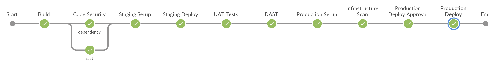

# DevSecOps
DevSecOps pipeline setup using GitLab Security Products

## Setup details:
### [DevOps lab][salecha] by Rohit Salecha
Modified to use 4 machines
- Docker Registry
- Jenkins Server
- Staging Server
- Production Server

Follow [this][post] post to setup the lab

### GitLab Security Tools
- [Dependency Scanning][depscan]
- [SAST][sast]
- [DAST][dast]
- [Container Scanning][container]

### Docker based Web Application
https://github.com/npatta01/web-deep-learning-classifier

[salecha]: <https://github.com/salecharohit/devops>
[depscan]: <https://docs.gitlab.com/ee/user/application_security/dependency_scanning/index.html>
[sast]: <https://docs.gitlab.com/ee/user/application_security/sast/index.html>
[dast]: <https://docs.gitlab.com/ee/user/application_security/dast/>
[container]: <https://docs.gitlab.com/ee/user/application_security/container_scanning/>
[post]: <https://www.rohitsalecha.com/project/practical_devops/>
